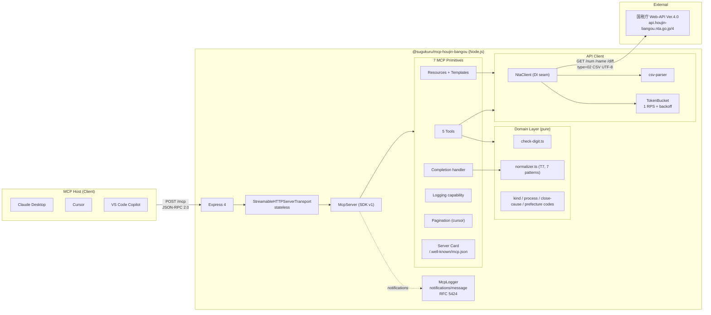
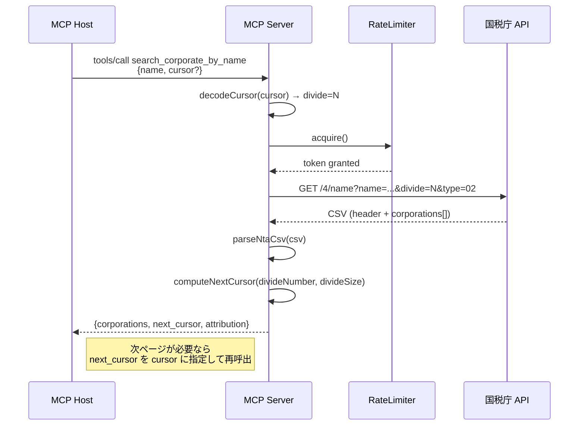
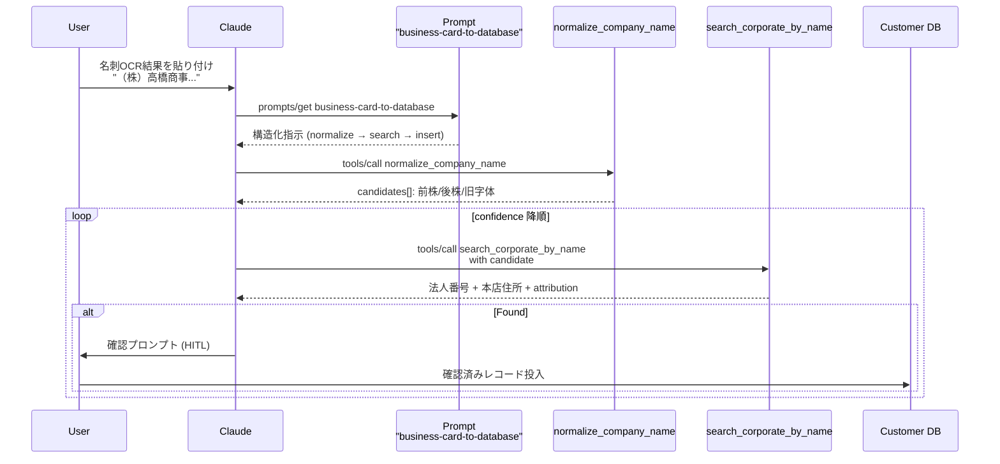
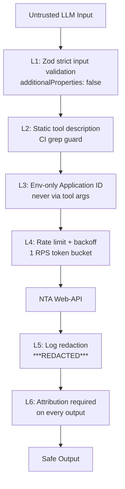

# Architecture / アーキテクチャ

## 全体図 / Overview

## レイヤー構造 / Layered Structure

| Layer | Path | Responsibility |
|---|---|---|
| **Transport** | `src/server.ts` | Express + Streamable HTTP boot + stateless transport |
| **MCP Protocol** | `src/mcp.ts` | McpServer factory + capability negotiation |
| **Primitives** | `src/tools/` `src/resources/` `src/completion/` | Tool / Resource / Completion handlers |
| **Domain** | `src/domain/` | 純粋ロジック (check-digit, normalizer, codes) |
| **External IO** | `src/api/` | NTA API client + CSV parser + rate limiter |
| **Cross-cutting** | `src/lib/` | env / errors / result / logger / pagination |

## データフロー: 法人名検索 + ページング

## データフロー: 名刺OCR ワークフロー (v0.2.0 予定)

## プロンプトインジェクション防御層

## 参考 / References

- 国税庁 Web-API 仕様書 第一編 (4.9版) / 第二編 (1.2版) / 第六編 (1.2版)
- MCP 公式仕様 (2025-11-25)
- 2026 MCP Roadmap (2026-03-09)
- Transport WG "Exploring the Future of MCP Transports" (2025-12-19)
- SEP-2127 Server Card (Draft) / SEP-1303 Input Validation (Final) / SEP-986 Tool Names (Final)
- Simon Willison "MCP has prompt injection security problems" (2025-04-09)
