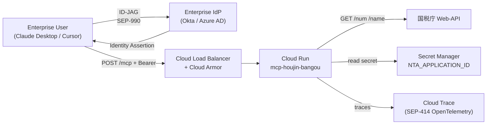

# Cloud Run デプロイ (v0.5.0 Hosted 準備資料)

> **v0.5.0 Hosted 版 (2026-09 予定) の設計メモ。現時点で本書の手順は未検証。**

## アーキテクチャ概要



## 前提

- GCP プロジェクト `sugukurucorpsite` (Compass の `ssw-compass-prod-494613` とは分離)
- Artifact Registry / Container Registry の権限
- Cloud Run / Cloud Armor / Secret Manager / Cloud Trace の API 有効化
- Enterprise-Managed Authorization (SEP-990) に対応した IdP (Okta / Azure AD / etc.)

## 1. Secret Manager にアプリケーション ID を格納

```bash
gcloud secrets create nta-application-id \
  --replication-policy automatic

echo -n "YOUR_NTA_ID" | gcloud secrets versions add nta-application-id --data-file=-

# Cloud Run から読める権限
gcloud secrets add-iam-policy-binding nta-application-id \
  --member "serviceAccount:mcp-houjin-bangou@sugukurucorpsite.iam.gserviceaccount.com" \
  --role "roles/secretmanager.secretAccessor"
```

## 2. Docker イメージのビルド (v0.3.0 以降)

```bash
gcloud builds submit --tag gcr.io/sugukurucorpsite/mcp-houjin-bangou:v0.5.0
```

## 3. Cloud Run デプロイ

```bash
gcloud run deploy mcp-houjin-bangou \
  --image gcr.io/sugukurucorpsite/mcp-houjin-bangou:v0.5.0 \
  --region asia-northeast1 \
  --platform managed \
  --service-account mcp-houjin-bangou@sugukurucorpsite.iam.gserviceaccount.com \
  --set-secrets NTA_APPLICATION_ID=nta-application-id:latest \
  --set-env-vars LOG_LEVEL=info,NODE_ENV=production \
  --cpu 1 \
  --memory 512Mi \
  --concurrency 80 \
  --min-instances 1 \
  --max-instances 10 \
  --timeout 60s \
  --no-allow-unauthenticated
```

### Cloud Run 選定理由 (ADR メモ)

- **Stateless MCP (ADR-0002) と相性抜群** — sticky session 不要で水平スケール可能
- **無料枠が大きい** — 月 200万リクエストまで無料
- **Cold start 軽減** — `--min-instances 1` で常時 1 インスタンス
- Transport WG Dec 2025 blog の "enable serverless viability for advanced MCP features" 方針と整合

## 4. Cloud Armor (WAF + Rate Limit)

```bash
gcloud compute security-policies create mcp-houjin-bangou-policy \
  --description "Rate limit + geo-restrict for MCP server"

# 1 IP あたり 100 RPS 上限
gcloud compute security-policies rules create 1000 \
  --security-policy mcp-houjin-bangou-policy \
  --action throttle \
  --src-ip-ranges '*' \
  --rate-limit-threshold-count 100 \
  --rate-limit-threshold-interval-sec 60 \
  --conform-action allow \
  --exceed-action deny-429 \
  --enforce-on-key IP

# 国税庁 API への 1 RPS 制限は本 MCP 内部で担保済み
```

## 5. Enterprise-Managed Authorization (SEP-990)

v0.5.0 で `io.modelcontextprotocol/enterprise-managed-authorization` extension を有効化予定:

```typescript
// src/mcp.ts (v0.5.0 拡張)
new McpServer(
  { name, version },
  {
    capabilities: {
      extensions: {
        'io.modelcontextprotocol/enterprise-managed-authorization': {},
        'io.modelcontextprotocol/oauth-client-credentials': {},
      },
      // ...
    },
  },
);
```

ID-JAG 検証は MCP Authorization Server (本 MCP サーバの一部) が担当。Sugukuru 側の認可サーバーを別途構築する設計。

## 6. OpenTelemetry Trace Context (SEP-414)

Express middleware で `traceparent` ヘッダを受け、Cloud Trace にエクスポート:

```typescript
// src/server.ts (v0.5.0 予定)
import { NodeSDK } from '@opentelemetry/sdk-node';
import { TraceExporter } from '@google-cloud/opentelemetry-cloud-trace-exporter';

const sdk = new NodeSDK({
  traceExporter: new TraceExporter(),
});
sdk.start();
```

## 7. モニタリング

- **Cloud Run metrics**: latency (p50/p95/p99) / error rate / instance count
- **Custom metrics via pino + Cloud Logging**: NTA API 403 受信率 / token bucket 枯渇率
- **Uptime check**: 1 分毎に `/health` にアクセス
- **Alert**:
  - HTTP 5xx rate > 1% で 5分継続
  - `/health` が 3 連続失敗
  - NTA API 403 が 10分内に 5 回以上

## 8. 災害復旧

- Region failover: `asia-northeast1` (東京) + `asia-northeast2` (大阪) に同構成デプロイ、Cloud Load Balancer で切替
- Secret Manager はデフォルトで multi-region 複製
- 国税庁側のメンテ中は Hosted 側で `503` を返し、復旧後に自動再開

## 9. エンタープライズ契約条件 (v0.5.0 時点で確定予定)

- SLA: 月間 99.5% 稼働
- 応答時間 SLO: p95 < 500ms (国税庁 API 応答時間を除く)
- サポート: Slack Connect または Email、営業時間内 4 時間以内
- 料金: 別途見積り (本 OSS は MIT で無料、Hosted は運用サービス料金)

エンタープライズ利用の問合せ: `engineering@sugukuru.co.jp`
