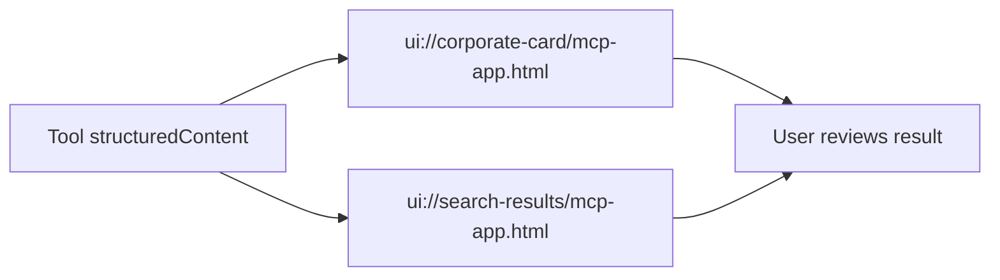

# UI Resources

v0.2.0 では MCP Apps / UI Resources を、既存の 5 Tools に重ねる表示層として導入する。

## 目的

UI は新しい業務ロジックを持たない。Tool の structured output を、人間が確認しやすい形に変換するだけである。



## Resources

| URI | 用途 | 接続 Tool |
|---|---|---|
| `ui://corporate-card/mcp-app.html` | 単一法人の詳細カード | `lookup_corporate_by_number` |
| `ui://search-results/mcp-app.html` | 法人名検索結果の表 | `search_corporate_by_name` |

## Tool metadata

`tools/list` に以下の `_meta.ui.resourceUri` を出す。

```json
{
  "lookup_corporate_by_number": {
    "_meta": {
      "ui": { "resourceUri": "ui://corporate-card/mcp-app.html" }
    }
  },
  "search_corporate_by_name": {
    "_meta": {
      "ui": { "resourceUri": "ui://search-results/mcp-app.html" }
    }
  }
}
```

## UI actions

UI から server tool を呼ぶ動線:

- `corporate-card`
  - 「類似商号を検索」 → `search_corporate_by_name`
  - 「法人番号をコピー」 → browser clipboard
- `search-results`
  - 行クリック → `lookup_corporate_by_number`

## Build

```bash
pnpm build:ui
pnpm build:csp
```

生成物:

```text
dist/ui/corporate-card/mcp-app.html
dist/ui/search-results/mcp-app.html
```

Vite + `vite-plugin-singlefile` により、HTML / JS / CSS は 1 ファイルへ inline される。

## CSP

`scripts/compute-csp-hashes.ts` が build 後の HTML から inline script/style の SHA-256 hash を計算し、`<meta http-equiv="Content-Security-Policy">` を注入する。

方針:

- `default-src 'none'`
- `connect-src 'none'`
- `frame-src 'none'`
- `object-src 'none'`
- `require-trusted-types-for 'script'`
- `trusted-types houjin-mcp-ui`

UI は直接 API fetch しない。すべて `app.callServerTool()` 経由で MCP Host に委譲する。

## Preview fixtures

実機ホストなしで表示設計を確認するため、以下を用意:

- `docs/assets/ui-fixtures/corporate-card.json`
- `docs/assets/ui-fixtures/search-results.json`
- `docs/assets/ui-preview.html`

`ui-preview.html` は MCP Host の `postMessage` handshake に依存しない静的プレビューで、README 用スクリーンショット作成に使う。

## Remaining v0.2.0 work

- Claude Desktop / MCP Inspector で iframe 表示確認
- screenshots / GIF
- UI visual polish
- host compatibility notes
